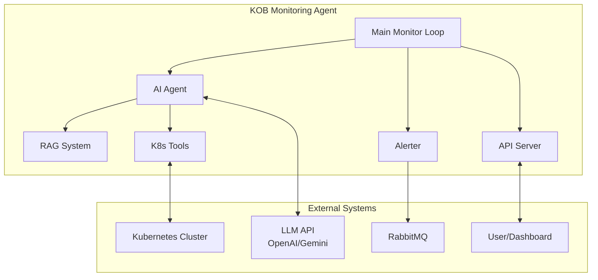

# KOB Monitoring Agent

An AI-powered monitoring agent for Kubernetes on Bare Metal (KOB) clusters that proactively monitors cluster health, diagnoses issues using RAG and LLM capabilities, and either alerts humans or attempts predefined automated fixes.

## KOB Monitoring Agent Architecture



## Features

- **AI-Powered Diagnosis**: Uses LLMs (OpenAI/Gemini) to diagnose Kubernetes issues
- **Retrieval-Augmented Generation (RAG)**: Enhances diagnosis with Kubernetes documentation
- **Proactive Monitoring**: Continuously checks for pod and node issues
- **Alerting System**: Sends detailed alerts to RabbitMQ for integration with notification systems
- **Optional Auto-Remediation**: Can automatically fix certain well-defined issues
- **Status API**: Optional FastAPI endpoint for monitoring the agent's status
- **Containerized**: Ready for deployment in Kubernetes or standalone environments

## Technical Stack

- **Python 3.9+**: Core runtime environment
- **LangChain**: Agent framework for LLM orchestration and tool usage
- **LlamaIndex**: RAG system for enhanced knowledge retrieval
- **Kubernetes Python Client**: Direct K8s API interaction
- **LLMs**: Support for either OpenAI or Google Gemini APIs
- **RabbitMQ**: Alerting and notification system
- **FastAPI**: Optional status API endpoint
- **Docker**: Containerization for easy deployment

## Getting Started

### Prerequisites

- Python 3.9+
- Access to a Kubernetes cluster
- RabbitMQ server
- OpenAI API key or Google Gemini API key
- Kubernetes documentation files (for RAG)

### Installation

#### From Source

1. Clone this repository:
   ```bash
   git clone https://github.com/yourusername/kob-monitoring-agent.git
   cd kob-monitoring-agent
   ```

2. Install dependencies:
   ```bash
   pip install -r requirements.txt
   ```

3. Create a docs directory and populate it with Kubernetes documentation:
   ```bash
   mkdir -p docs
   # Add your Kubernetes documentation files here
   ```

4. Set up environment variables:
   ```bash
   export KUBECONFIG=/path/to/your/kubeconfig
   export MONITORED_NAMESPACES=default,kube-system
   export LLM_PROVIDER=openai  # or gemini
   export LLM_API_KEY=your-api-key
   export RABBITMQ_HOST=localhost
   export RABBITMQ_PORT=5672
   export RABBITMQ_QUEUE=k8s-monitor-alerts
   ```

5. Run the agent:
   ```bash
   python main.py
   ```

#### Using Docker

1. Build the Docker image:
   ```bash
   docker build -t kob-monitoring-agent:latest .
   ```

2. Run the container:
   ```bash
   docker run -d \
     --name kob-agent \
     -v /path/to/kubeconfig:/app/.kube/config \
     -v /path/to/k8s-docs:/app/docs \
     -e KUBECONFIG=/app/.kube/config \
     -e MONITORED_NAMESPACES=default,kube-system \
     -e LLM_PROVIDER=openai \
     -e LLM_API_KEY=your-api-key \
     -e RABBITMQ_HOST=rabbitmq-host \
     -e RABBITMQ_PORT=5672 \
     -e RABBITMQ_QUEUE=k8s-monitor-alerts \
     -e API_ENABLED=true \
     -e API_PORT=8080 \
     -p 8080:8080 \
     kob-monitoring-agent:latest
   ```


## RAG Documentation Setup

For optimal performance, populate the `docs` directory with relevant Kubernetes documentation:

1. Official Kubernetes documentation
2. Troubleshooting guides
3. Best practices documents
4. Common error solutions

Text files should be in plain text, Markdown, or HTML format for optimal indexing.

## Auto-Fix Rules

Auto-fix rules are defined in a JSON structure that maps error patterns to actions:

```json
{
  "rules": [
    {
      "pattern": "TransientNetworkError",
      "deployment": "networking-service",
      "action": "restart_deployment",
      "namespace": "networking"
    },
    {
      "pattern": "TemporaryDatabaseConnection",
      "deployment": "database-service",
      "action": "restart_deployment",
      "namespace": "database"
    }
  ]
}
```

Pass this as a string in the `AUTO_FIX_RULES` environment variable.

## API Endpoints

When enabled, the API provides these endpoints:

- `GET /status` - Current agent status, configuration, and statistics
- `GET /health` - Simple health check endpoint

## Alert Format

Alerts sent to RabbitMQ have this structure:

```json
{
  "anomaly_type": "PodIssue",
  "anomaly": "web-app-123: CrashLoopBackOff",
  "diagnosis": "The container is failing because it cannot connect to the database...",
  "namespace": "default",
  "timestamp": 1651234567.89
}
```

## Contributing

1. Fork the repository
2. Create a feature branch: `git checkout -b feature/amazing-feature`
3. Commit your changes: `git commit -m 'Add amazing feature'`
4. Push to the branch: `git push origin feature/amazing-feature`
5. Open a Pull Request

## License

This project is licensed under the MIT License - see the LICENSE file for details.

## Acknowledgments

- [LangChain](https://langchain.com/) for the Agent framework
- [LlamaIndex](https://www.llamaindex.ai/) for RAG capabilities
- [Kubernetes](https://kubernetes.io/) Python client